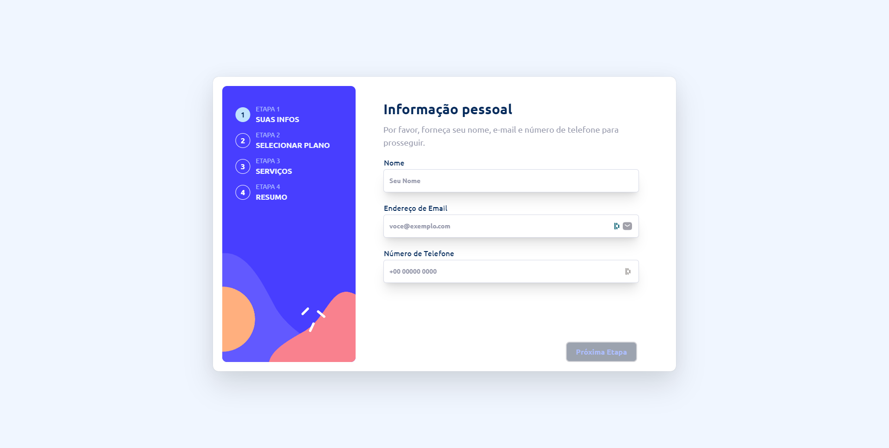

# Frontend Mentor - Multi-step form solution

This is a solution to the [Multi-step form challenge on Frontend Mentor](https://www.frontendmentor.io/challenges/multistep-form-YVAnSdqQBJ). Frontend Mentor challenges help you improve your coding skills by building realistic projects.

## Table of contents

- [Overview](#overview)
  - [The challenge](#the-challenge)
  - [Screenshot](#screenshot)
  - [Links](#links)
- [My process](#my-process)
  - [Built with](#built-with)
  - [What I learned](#what-i-learned)
  - [Continued development](#continued-development)
  - [Useful resources](#useful-resources)
- [Author](#author)

## Overview

### The challenge

Users should be able to:

- Complete each step of the sequence
- Go back to a previous step to update their selections
- See a summary of their selections on the final step and confirm their order
- View the optimal layout for the interface depending on their device's screen size
- See hover and focus states for all interactive elements on the page

* Extras posted by me

- The button only activates when everything is correctly formatted
- Texts translated for people from brazil, if it's not from brazil it's back to english
- Information is saved even if you go to the next step and come back
- NextUi animations added

### Screenshot



### Links

- Solution URL: [Add solution URL here](https://your-solution-url.com)
- Live Site URL: [Add live site URL here](https://your-live-site-url.com)

## My process

### Built with

- Semantic HTML5 markup
- CSS custom properties
- Flexbox
- CSS Grid
- Mobile-first workflow
- [React](https://reactjs.org/) - JS library
- [Vite.dev](https://vitejs.dev/) - React framework
- [Tailwind CSS](https://tailwindcss.com/) - For styles
- [NextUI](https://nextui.org/) - For UI

### What I learned

Use this section to recap over some of your major learnings while working through this project. Writing these out and providing code samples of areas you want to highlight is a great way to reinforce your own knowledge.

To see how you can add code snippets, see below:

```tsx
<Input
  type="text"
  name="name"
  label={isGringo ? "Name" : "Nome"}
  placeholder={isGringo ? "Your Name" : "Seu Nome"}
  labelPlacement="outside"
  errorMessage={isGringo ? "This field is required" : "O campo é obrigatório"}
  value={step1Data.name}
  onChange={handleChange}
  classNames={{
    label: [
      "text-[var(--colorMarineBlue)] font-medium text-base",
      "group-data-[filled-within=true]:text-[var(--colorMarineBlue)]",
    ],
    input: [
      "bg-white",
      "text-[var(--colorPurplishBlue)] font-bold",
      "placeholder:text-[var(--colorCoolGray)]",
      "group-data-[has-value=true]:text-[var(--colorPurplishBlue)]",
    ],
    innerWrapper: ["bg-transparent"],
    inputWrapper: [
      "shadow-xl",
      "bg-[var(--colorWhite)]",
      "group-data-[focus-visible=true]:ring-[var(--colorMarineBlue)]",
      "group-data-[hover=true]:bg-gray-200",
      "backdrop-blur-sm",
      "rounded-md",
      "!cursor-text",
      "border border-[var(--colorLightGray)]",
      "py-6",
    ],
  }}
/>
```

### Continued development

Next project will be a game of rock paper and scissors [Challenge](https://www.frontendmentor.io/challenges/rock-paper-scissors-game-pTgwgvgH)

### Useful resources

- [Button NextUI](https://nextui.org/docs/components/button) - helped me with the animation of the buttons
- [Input NextUI](https://nextui.org/docs/components/input) - helped me design the inputs

## Author

- Website - [davidsntdev](https://davidsntdev.github.io/sites/)
- Frontend Mentor - [@dvd1337](https://www.frontendmentor.io/profile/dvd1337)
- Twitter - [@DillNTC](https://www.twitter.com/DillNTC)
